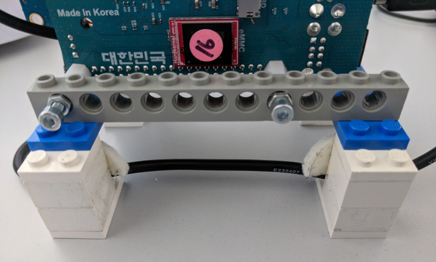
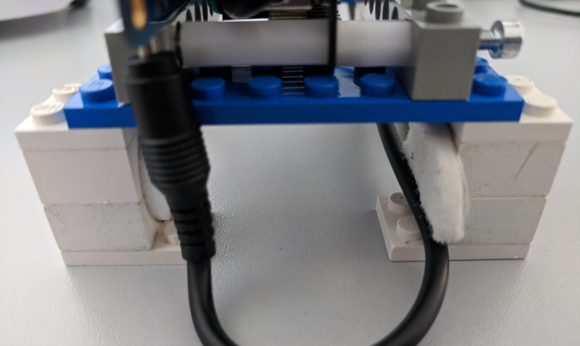
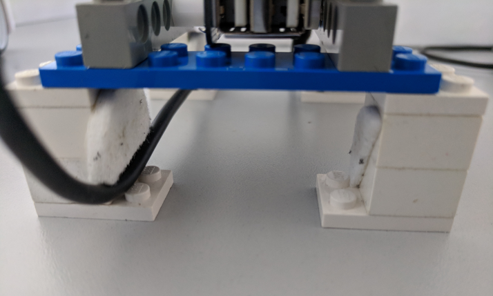

# Mighty Thymio (MyT) how to:

## Assembly 

What is included?

1. Thymio base
2. Main computer block composed of:
   1. Main computer
   2. Connection wires 
   3. Support blocks (lego pieces)
3. Battery pack 
4. Wireless antenna 

### Steps to assemble the MyT

Before starting the assemble process **carefully verify** that:

1. The printed numbers on the base, wifi antenna and main computer are the same. If this is not the case look for the correct one or request help.
2. The switch on the right of the main computer is **turned down**.

To assemble the MyT follow the next steps:

1. Carefully pull off the parts from the box.

> If the support blocks are detached, follow the images in the [appendices](#appendices) section to put them back together. **Do not** continue with the assembling process until the support blocks are properly connected.

2. Mount the main computer block on top of the Thymio base:

> Use the lego marks on top of the base as a guide.

3. Connect the usb-to-micro-usb wire from the main computer to the base:

4. Connect the wifi antenna to the main computer:

5. Insert the battery pack in the space between the main computer and the base:

6. Connect the power wire (coming from the main computer) to the battery pack:

The assembled MyT should look like as depicted:

Once the MyT is assembled, pull the battery out a couple of centimeters and push the small button on the side of the battery; a few leds on the battery will light up to indicate its charge level.  Always make sure the external battery pack is properly charged, otherwise the system may be unstable.  If the system is properly assembled, a blue LED on top of the switch in main computer should turn on. 

## Power on:

> MyT has 3 power sources: one in the thymio base, one silver battery pack besides the main computer (mark with the MyT number), and the white external battery pack. **Before running any experiment make sure the external battery pack is properly charged.**  The battery pack can be charged with any micro-usb cable.

Follow the next steps to bring up the MyT software (OS and ROS):

1. Turn up the switch on the right of the main computer. 

 > Two LEDs on top of the main computer will turn on and an ascending tune will play. The fixed red LED indicates that the switch is up, the blinking blue LED indicates that the computer is *operating*.  The system will go through some phases where different leds light up on the thymio base.
 
2. Wait until the red led on the `back` arrow on the base starts to blink (the whole boot process should take about 1 minute).
   1. If the LED is blinking it means ROS is ready.
   2. If there is no blinking, something went wrong (see [fix](#appendices) for corruption error or request help).

> There are three body LEDs indicators in the base, one at the top and two at the sides. If the LEDs are green it means external battery is connected; yellow means external battery is not connected but there is still power in internal sources; red means internal sources are critically low.

## Connect to the real MyT

Each MyT creates its own access point (AP) with the name `thymioX`, where `X` is the number printed on the stickers.

1. Connect to the corresponding MyT AP (key is `idsia1234`).
2. Setup the environment variable to reach the ROS master in the MyT. 

`export ROS_MASTER_URI=http://thymioX:11311`

3. As a simple verification, run `rostopic list` to confirm that the connection was done properly. A list of topics from the corresponding MyT should appear, e.g. `/thymioX/odom`.

> All exposed topics from the ROS controller follow the convention `/thymioX/topic_name`.

## Change network mode (advanced):

MyT has three network modes: off, AP (default) and managed. Managed mode will connect to a predefined access point. 

> Internet connection is not present in AP mode. If internet connection is needed while in AP mode, an Ethernet cable (with internet connection) must be attached to the main computer.
> Managed mode should only be used when the predefined access point is present.

To change the network mode:

1. Press and hold the `right` arrow until an orange indicator appears. 
2. Press the `left` arrow to select a mode (down off, down-left AP, left . 
3. Press the `middle` button to confirm the selection.

## Power off (important!)

> **Improperly powering-off the MyT could result in a corrupted storage, which creates problems during the power-on process**

To properly power-off the MyT:

1. Press and hold the `back` arrow (about 5s) until a descending tune is played and the base turn off. This will start the shutdown process of the main computer.
2. Wait until the base restarts (there will be an ascending tune). This will be an indication that the main computer has turned-off correctly. Additionally, verify that only the red LED on top of the main computer is on, the blue one should be off.
> As the base has restarted, the lights on the base should be on.  This is expected.
3. At this point turn down the main switch of the main computer.
4. Press and hold the middle button on the base until the base is switched off. A descending tune will be played and the lights on the base will turn off.  The MyT is now off.

## Update the MyT software

> This process is only for internal development **do not** use it unless it is explicitly requested.

1. Switch to managed mode or connect an Ethernet wire to the MyT while in AP mode.
2. Press and hold `left` arrow for 6 seconds (there will not be any sound or light feedback). 
3. Updating process will take about 2min. When the updating process is finished, the MyT will restart.

## Appendices

### Support blocks

Different views of the support blocks 

### Corruption error fix

(TO DO)
