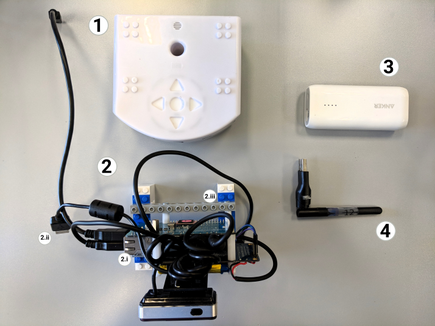
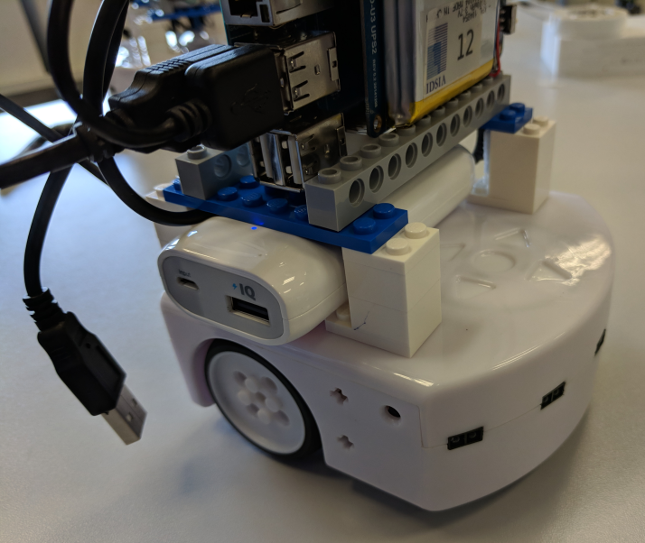

## Mighty Thymio (MyT) how to:

## Assemblage 

What is included?

1. Thymio base
2. Main computer block compose of:

   a. computer section 
   b. connection wires 
   c. support blocks (lego pieces)

3. Battery pack 
4. Wireless antenna 

### Steps to assemble the MyT

> Before assembling **verify** that printed number on the base, wifi antenna and main computer are the same.

1. Pull of the parts from the box.
> If the support blocks are detached, follow the images in the appendices section to put them back together. **Do not** continue with the assembling process until the support blocks are properly connected.

2. Mount the computer block on top of the Thymio base:

> Use the lego marks on top of the base as a guide.

3. Connect the usb-to-mini-usb wire from the main computer to the base:

4. Connect the wifi antena to the main computer:

5. Insert the battery pack in the space between the main computer and the base:

6. Connect the power wire (coming from the main computer) to the battery pack:

The assembled MyT should look like as depicted:

Once the MyT is assembled, a led on top of the switch in main computer will turn on. 

## Power on:

> MyT has 3 power sources: in the base base, by the side of the main computer (mark with the MyT number), and the external battery pack. **Before running any experiment be sure to have the battery pack properly charged.**

Follow these steps to bring up the MyT:

1. Turn up the switch on the right of the main computer. 

 > Two leds on top of the main computer will turn on and a sound will trigger. Red led indicates the switch is up, blue led indicates the computer is *working*.
 
2. Wait until the `back` arrow on the base starts to blink red.

  a. Once it is blinking it means ROS system inside the MyT is ready.
  b. If there is no blinking, something went wrong (see fix for corruption error)

> There three body leds ( one at the top and two at the sides). If the LEDs are green it means external battery is connected; yellow means external battery is not connected but there is still power in internal sources; red means internal sources critically low.

## Connect to the real MyT

Each MyT creates its own access point (AP) with the name `thymioX`, where `X` is the number printed on the stickers.

1. Connect to the corresponding AP. Password is `idsia1234`
2. Setup the environment variable to reach the ROS master in the MyT. 

`export ROS_MASTER_URI=http://thymioX:11311`

3. As a simple verification, run `rostopic list` to confirm that the connection was done properly. A list of topics from the corresponding MyT should appear, e.g. `/thymioX/odom`

> All exposed topics from the ROS controller follow the convention `/thymioX/topic_name` 

## Change network mode:

MyT has three network modes, off, AP (default) and managed. managed mode will connect to a predefined access point named.
> Internet connection is not present in AP mode. If internet connection is needed while in AP mode, an Ethernet cable (with internet connection) must be attached to the main computer.
> Custom mode should only be used when the predefined access point is present.

To change the network mode:

1. Press and hold the `right` arrow until an orange indicator appears. 
2. Press the `left` arrow to select a mode (down off, down-left AP, left . 
3. Press the middle button to confirm the selection.

## Turn off:

> **Improperly turning-off the MyT could result in a corrupted turn-on process**

To properly turn-off the MyT:

1. Press and hold the `back` arrow (about 5s) until a sound triggers. This will start the shutdown process of both the base and the main computer.
2. Wait until the MyT base restarts (another short sound). This will be an indication that the main computer has turned-down correctly. Additionally, only the red led on top of the main computer will be on, the blue one will be off.
> As the base restarted there will be lights on 
3. At this point turn down main switch of the main computer.
4. Press and hold the middle button on the base until the base is switch off. A sound will trigger and the lights will turn off.

## Update software in thymio (ONLY FOR INTERNAL DEVELOPMENT):
-- connect to drone_wifi, or an ethernet in AP mode
-- hold LEFT ARROW (5 sec, no blink or sound)
-- it will take about 3min, no feedback (be aware)

## Appendices

Different views of the support blocks 

